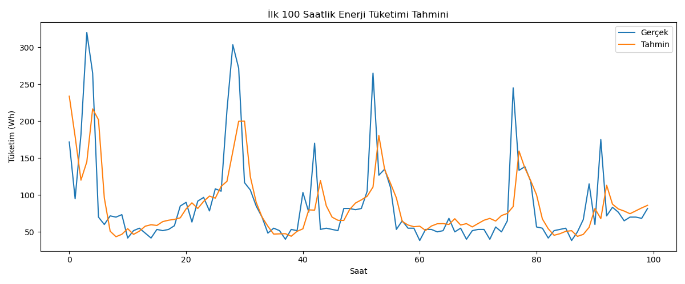
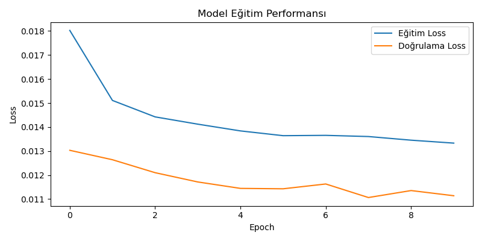

# 🔌 Energy Predictor LSTM

End-to-end AI system that predicts hourly energy consumption of a smart building using LSTM.

## 📌 Project Overview

This project builds a time-series forecasting model using LSTM neural networks to predict energy consumption based on past appliance usage data. The system simulates how smart buildings can optimize their energy management.

## 🧠 Technologies Used

- Python
- Pandas, NumPy
- Scikit-learn
- TensorFlow / Keras (LSTM)
- Matplotlib / Seaborn

## 🔄 Pipeline

1. Load and clean time-series data
2. Normalize and sequence for LSTM input
3. Train the LSTM model
4. Generate predictions and visualize results
5. Save model for edge deployment (`.h5`)

## 📊 Dataset

UCI Appliances Energy Prediction Dataset  
[Download link](https://archive.ics.uci.edu/ml/machine-learning-databases/00374/energydata_complete.csv)

## 🧩 Business Impact

- Can be embedded in edge devices for smart home automation
- Predictive maintenance and energy cost optimization for industrial facilities
- Ideal for Eksim Holding’s AI-powered energy infrastructure

## 📈 Sample Output

> Predictions vs Actual — plotted for first 100 hours.
> Model accuracy evaluated with MSE loss.

---

## 🔍 Model Tahmin Sonucu

---

## 📉 Eğitim Süreci

### 📉 Validation vs Training Loss

This plot shows the model's training and validation loss over epochs, demonstrating both the learning process and the generalization performance of the LSTM model.

